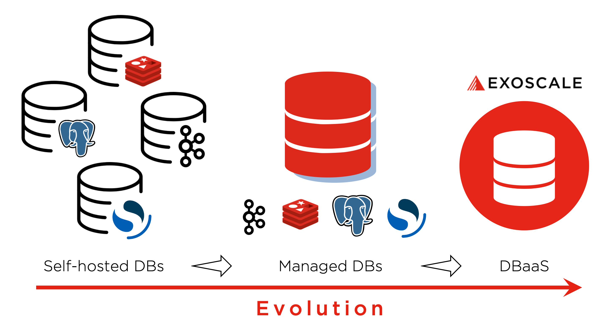

### Evolution of Data Services

There is a rapidly increasing popularity of managed data services, and many companies are on the lookout to find the most fitting service for the tasks at hand. So, not over stressing running a data center but still trying to drive this essential message home. Questions like:

- How many servers do I need?
- Do I have to cluster my services?
- Which database do I need?
- Do I need more than one database technology?

The questions can go on and on; thinking about them and solving them can easily cause bad headaches. So, finally, it comes down to an easy decision on the question: "Self-Hosted vs Managed?" And if you are not in the hosting business, you're set and done.

The last question from the list above is essential in modern applications because usually one database technology is not enough. Application architecture has changed a lot, and the usage of data technologies with it. Look at the diagram below for a glimpse into the new application design and the impact on database features needed and used. Self-hosted is out of the race; managed is the way to go, end of the story. Managed Databases are the next step in the evolution, but an extensive DBaaS portfolio is the ultimate goal.



Looking back on the diagram of the example application shows that more and more data technologies are being utilized. So, sourcing different database technologies from a managed service provider is definitely not the final solution there. However, they are reducing complexity, increasing convenience for data service usage.

Meaning we have to look for a managed database technology portfolio, ideally from one provider. Hence, Exoscale DBaaS is precisely that.

 

If you want to have a QuickStart with these technologies, go to our DBaaS Documentation [here](https://community.exoscale.com/documentation/dbaas/quick-start/).