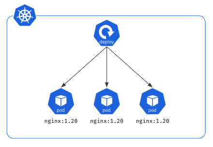
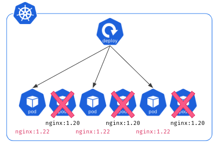
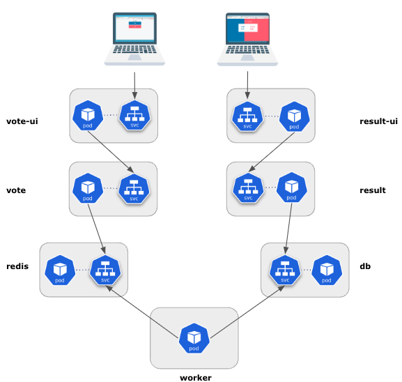

## What is a Deployment ?

A Deployment is used to manage one or more Pods with the same specification. It manages the Pod lifecycle:  

- creation and deletion
- scaling
- progressive deployment (Rollout) and rollback

There are an additional level of abstraction:  

- Deployment: creates and updates applications
- ReplicaSet: ensures the number of Pod replicas
- Pod: smallest workload unit containing one or more containers

## From Pod to Deployment

Pod are rarely created directly, they are usually managed by higher level resources such as:

- Deployment
- DaemonSet
- Job
- CronJob
- StatefulSet

The choice of resource depends on the application’s use case. For example, a Deployment manages the lifecycle of multiple identical Pods and ensures that a specified number of Pods are always running.

The following specification defines a Pod with a unique container running the *nginx:1.20* image:

```yaml {filename="pod.yaml"}
apiVersion: v1
kind: Pod
metadata:
  name: www
  labels:             
    app: www
spec:
  containers:
  - name: www
    image: nginx:1.20
    ports:
    - containerPort: 80
```

If we want to manage 3 identical Pods having the previous specification, we can specify a Deployment as follows:

```yaml {filename="deploy.yaml"}
apiVersion: apps/v1
kind: Deployment
metadata:
  name: www
spec:
  replicas: 3
  selector:
    matchLabels:
      app: www
  template:
    metadata:
      labels:
        app: www
    spec:
      containers:
      - name: www
        image: nginx:1.20
        ports:
        - containerPort: 80
```

We can create this Deployment:

```bash
kubectl apply -f deploy.yaml
```



If a Pod is deleted, a new one is automatically created to replace it, ensuring that 3 Pods (replicas) are always running as specified



If we need to update an application, in order to use a newer image for the containers, we can easily do so modifying the Deployment specification and applying the new version.

Below is the updated deploy.yaml specification, the nginx image was changed from *nginx:1.20* to *nginx:1.22*:

```yaml {filename="deploy.yaml"}
apiVersion: apps/v1
kind: Deployment
metadata:
  name: www
spec:
  replicas: 3
  selector:
    matchLabels:
      app: www
  template:
    metadata:
      labels:
        app: www
    spec:
      containers:
      - name: www
        image: nginx:1.22
        ports:
        - containerPort: 80
```

We can send this new version of the specification to Kubernetes:

```bash
kubectl apply -f deploy.yaml
```

The Pods running *nginx:1.20* will gradually be replaced with Pods running *nginx:1.22*



## Base commands

- Creating a Deployment from a YAML file

```bash
kubectl apply -f deploy.yaml
```

- Creating a Deployment using an imperative command

```bash
kubectl create deploy www --image=nginx:1.22 --replicas=3
```

- Listing existing Deployments

```bash
kubectl get deploy
```

- Getting the Deployment’s properties

```bash
kubectl get deploy www -o yaml
```

- Getting the Deployment’s main properties

```bash
kubectl describe deploy www
```

- Changing the number of Pods managed by a Deployment (scaling operation)

```bash
kubectl scale deploy www --replicas=5
```

- Removing a Deployment

```bash
kubectl delete deploy www
```

## Using Deployments in the VotingApp

The previous exercise left the app with the following components:


We will now use Deployments to manage Pods instead of running the Pods directly. The Pods created by these Deployments will be exposed by the same Service.




