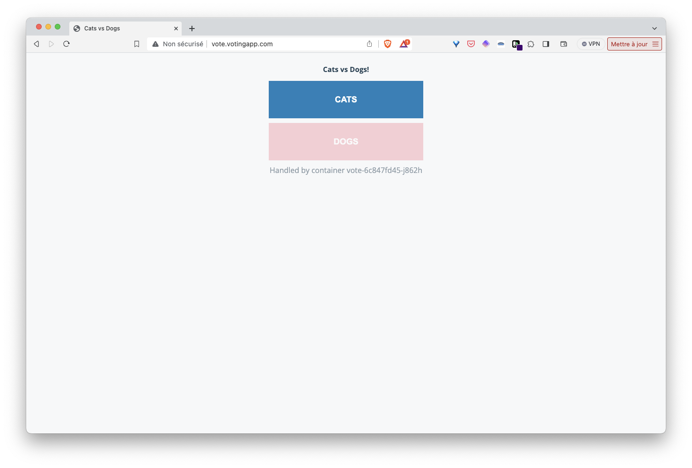
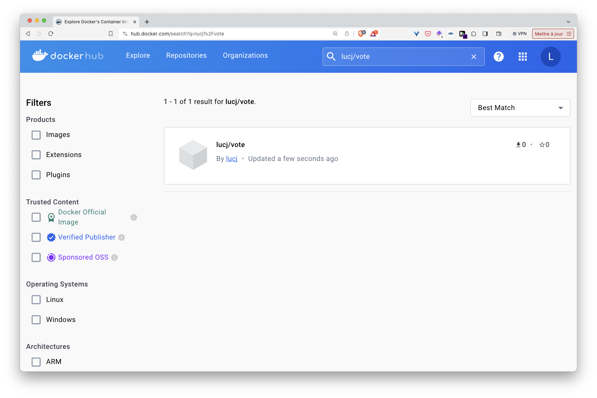
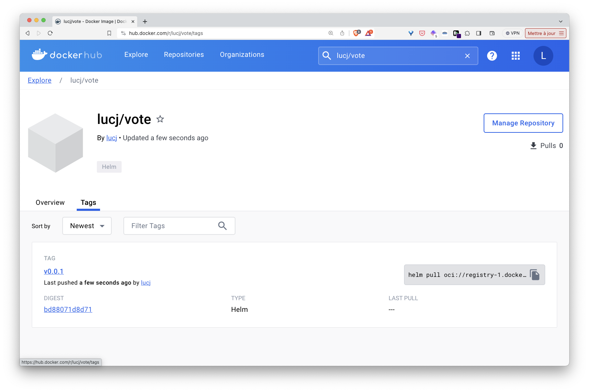

## Package and distribute the VotingApp with Helm

In this exercise, you will package the VotingApp application into a Helm Chart.

1. Install the Helm Client

If you do not already have the Helm client installed, you can do so using the following command:

```bash
curl -fsSL -o get_helm.sh https://raw.githubusercontent.com/helm/helm/main/scripts/get-helm-3
chmod 700 get_helm.sh
./get_helm.sh
```

2. Creating a Helm Chart

Use the following command to create a Chart named *vote*.

```bash
helm create vote
```

By default, it includes the following elements:

- a *Chart.yaml* file that defines the project metadata
- a template for creating a Deployment that manages a single Pod (based on nginx)
- a template for creating a Service to expose this Pod within the cluster
- a template for creating an Ingress resource to expose the service externally
- a *values.yaml* file used to substitute placeholders in the templates with dynamic values
- a *NOTES.txt* file that provides information on creating the release and during updates

You can view its contents using the tree command (install it first with "sudo apt install tree"):

```bash
$ tree vote/
vote/
├── Chart.yaml
├── charts
├── templates
│   ├── NOTES.txt
│   ├── _helpers.tpl
│   ├── deployment.yaml
│   ├── hpa.yaml
│   ├── ingress.yaml
│   ├── service.yaml
│   ├── serviceaccount.yaml
│   └── tests
│       └── test-connection.yaml
└── values.yaml
```

First, in the *templates* directory, delete the yaml files, the *NOTES.txt* file, and the *test* directory.  
Next, copy all the manifests from VotingApp into the *templates* directory.  
Also, delete the contents of the *values.yaml* file but do not delete the file itself.

The *vote* directory will then have the following contents:

```bash
$ tree vote/
vote/
├── Chart.yaml
├── charts
├── templates
│   ├── _helpers.tpl
│   ├── cronjob.yaml
│   ├── deploy-db.yaml
│   ├── deploy-redis.yaml
│   ├── deploy-result.yaml
│   ├── deploy-resultui.yaml
│   ├── deploy-vote.yaml
│   ├── deploy-voteui.yaml
│   ├── deploy-worker.yaml
│   ├── ingress.yaml
│   ├── pvc-db.yaml
│   ├── pvc-redis.yaml
│   ├── secret-db.yaml
│   ├── svc-db.yaml
│   ├── svc-redis.yaml
│   ├── svc-result.yaml
│   ├── svc-resultui.yaml
│   ├── svc-vote.yaml
│   └── svc-voteui.yaml
└── values.yaml
```

3. Deploying the Application

From the *vote* directory, deploy the application using the following command:

```bash
helm upgrade --install vote .
```

You should see a result similar to the one below:

```bash
Release "vote" does not exist. Installing it now.
NAME: vote
LAST DEPLOYED: Tue Feb 13 10:27:48 2024
NAMESPACE: default
STATUS: deployed
REVISION: 1
TEST SUITE: None
```

Then, check that all the Pods of the VotingApp are in the Running status:

```bash
$ kubectl get po
NAME                         READY   STATUS      RESTARTS   AGE
worker-56b544777-nt6wf       1/1     Running     0          45s
result-ui-5cdd74d999-bpwkj   1/1     Running     0          45s
vote-6c847fd45-jqvhr         1/1     Running     0          45s
vote-ui-74849dd9b4-gbmbp     1/1     Running     0          45s
redis-5c4f4598f5-n8kxf       1/1     Running     0          45s
result-854cd4779c-w4jhm      1/1     Running     0          45s
db-54d89ccb97-nxz7v          1/1     Running     0          45s
seed-28463608-dwgst          0/1     Completed   0          34s
```

Ensure that the application is accessible at *http://vote.votingapp.com* / *http://result.votingapp.com* (or at *http://vote.IP_OF_YOUR_VM.nip.io* / *http://result.IP_OF_YOUR_VM.nip.io* if you are using the nip.io approach)





4. Using the Helm templating

- Image Tags

You will ensure that image tags are no longer based on *latest* (which is actually a very bad practice) but on a value specified in the *values.yaml* file. First, add the following content to *values.yaml*:

```yaml
registry: voting
voteui:
  tag: v1.0.19
vote:
  tag: v1.0.13
worker:
  tag: v1.0.15
result:
  tag: v1.0.16
resultui:
  tag: v1.0.15
tools:
  tag: v1.0.4
```

Then, modify the specifications of the Deployments *voteui*, *vote*, *worker*, *result*, and *resultui* so that the image name is generated from the values of the *registry* property and the corresponding *tag* for the microservice. For example, the specification for the *voteui* Deployment will be modified as follows:

```yaml
apiVersion: apps/v1
kind: Deployment
metadata:
  labels:
    app: vote-ui
  name: vote-ui
spec:
  replicas: 1
  selector:
    matchLabels:
      app: vote-ui
  template:
    metadata:
      labels:
        app: vote-ui
    spec:
      containers:
        - image: {{ .Values.registry }}/vote-ui:{{ .Values.voteui.tag }}
          name: vote-ui
```

- Regular Vote Generation

You will now configure the creation of 5 dummy votes every 2 minutes. Add the following content to the end of the *values.yaml* file:

```bash
# Add dummy votes on a regular basis
seed: enabled
schedule: "*/2 * * * *"
number_of_votes: 5
```

Then, modify the *cronjob.yaml* specification as follows:

```yaml
{{ if .Values.seed }}{{ if eq .Values.seed "enabled" }} 
apiVersion: batch/v1
kind: CronJob
metadata:
  name: seed
spec:
  schedule: "{{ .Values.schedule }}"
  jobTemplate:
    metadata:
      name: seed
    spec:
      template:
        spec:
          containers:
          - image: voting/tools:{{ .Values.tools.tag }}
            name: seed
            env:
            - name: NUMBER_OF_VOTES
              value: "{{ .Values.number_of_votes }}"
            imagePullPolicy: Always
          restartPolicy: OnFailure
{{ end }}{{ end }}
```

This specification uses Helm templating language:  

- The cronjob is created only if the *seed* property exists and is equal to "enabled" in the values file
- The schedule for the cronjob is retrieved from the *schedule* property in the values file
- The number of votes is defined in the *NUMBER_OF_VOTES* environment variable, with the value also retrieved from the values file

Update the application using the same command used for creation:

```bash
helm upgrade --install vote .
```


The *values.yaml* file is used by default


The second revision of the application will then be created:

```bash
Release "vote" has been upgraded. Happy Helming!
NAME: votingapp
LAST DEPLOYED: Tue Feb 13 11:05:21 2024
NAMESPACE: default
STATUS: deployed
REVISION: 2
TEST SUITE: None
```

You will also see that the different Pods have been recreated to account for the changes made in their specifications:

```bash
$ kubectl get po
NAME                         READY   STATUS      RESTARTS   AGE
db-54d89ccb97-mp28m          1/1     Running     0          31m
redis-5c4f4598f5-wgw2r       1/1     Running     0          31m
seed-28463643-s2kzd          0/1     Completed   0          2m34s
seed-28463644-n5b4w          0/1     Completed   0          94s
seed-28463645-4kmqc          0/1     Completed   0          34s
result-ui-76bdf59f99-qks6w   1/1     Running     0          13s
vote-779875ff5b-t7drr        1/1     Running     0          13s
vote-ui-695759b448-c7jgw     1/1     Running     0          13s
result-66f5856c8b-xp9d6      1/1     Running     0          13s
worker-6c5d7ddcf5-hprn7      1/1     Running     0          12s
```

From the result interface, verify that 5 new votes are being created every 2 minutes.

5. Uninstalling the Application

Use the following command to uninstall the application:

```bash
helm uninstall vote
```

6. Distributing the Application

A Helm Chart can easily be packaged and distributed to an OCI registry like [DockerHub](https://hub.docker.com).

First, use the following command to log in to Docker Hub (if you don't have a Docker Hub account, you can [create one for free](https://hub.docker.com/signup) in just a few minutes):

```bash
echo $DOCKERHUB_PASSWORD | helm registry login registry-1.docker.io -u $DOCKERHUB_USERNAME --password-stdin
```

Then, create a package of the application (specifying version v0.0.1 for the application):

```bash
helm package --version v0.0.1 .
```

You can then push this package to DockerHub:

```bash
helm push vote-v0.0.1.tgz oci://registry-1.docker.io/$DOCKERHUB_USERNAME
```

The application is now available and ready to be retrieved from Docker Hub.







