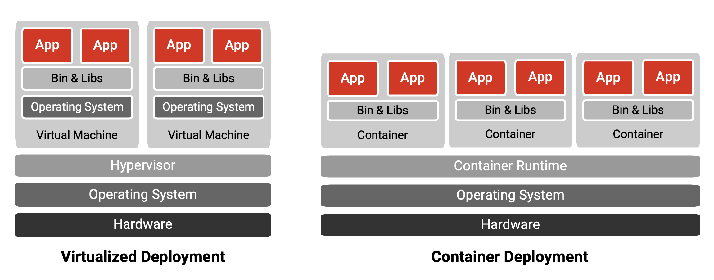

### Explained

Containers are lightweight, portable, and self-contained software packages that include all the necessary components to run an application, such as code, libraries, and dependencies.

Containers are isolated from the host operating system and other containers, allowing applications to run consistently across different environments and platforms. They are often used in cloud computing and DevOps environments to simplify application deployment, scaling, and management.

Containers are a popular technology for deploying microservices. They provide a lightweight and efficient way to package and deploy individual services. By encapsulating each microservice in its container, businesses can achieve greater modularity and flexibility in their application architecture. Additionally, containers can be easily scaled up or down to match changing demand, making it easier to manage resources and optimize performance.

However, there are also some potential drawbacks to using containers. For example, many containers can be complex and require additional tools and expertise. Additionally, containers can introduce security risks if not properly configured and managed. Despite these challenges, containers are becoming increasingly popular in modern software development. They provide a powerful and flexible way to deploy and manage microservices in cloud-native and DevOps environments.